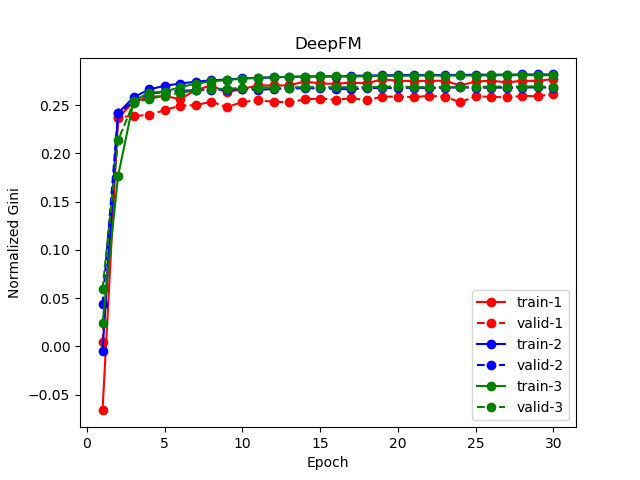
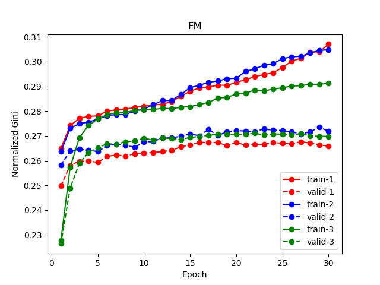
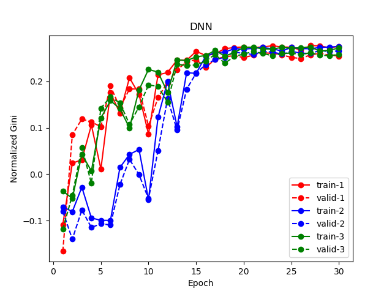
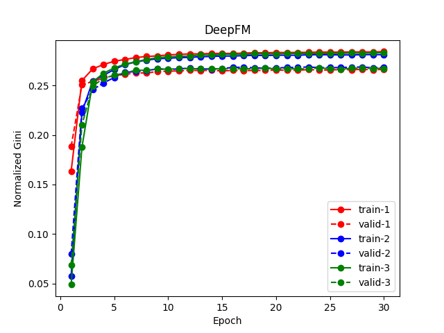
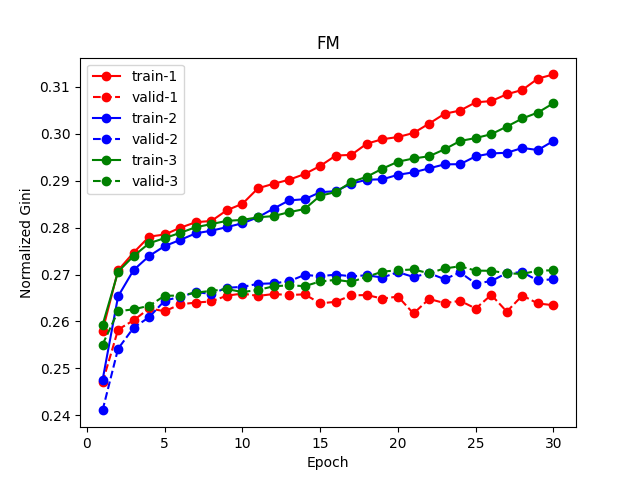
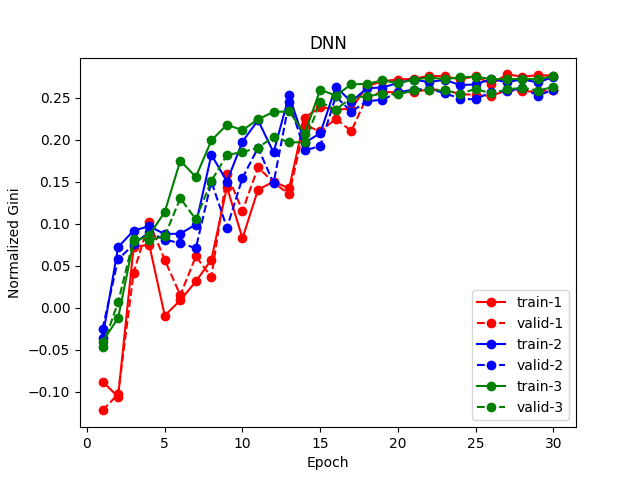

# DeepFM(TensorFlow)
## 支持情况

Models  | Framework  | Supported GPU   | Supported Data Precision  | Multi-GPUs  | Multi-Nodes
----- | ----- | ----- | ----- | ----- | ----- |
DeepFM  | TensorFlow  | V100/A100  | FP32/TF32 | Yes  | Not Tested

## Quick Start Guide
GPU Golden Bench通过运行launch.sh启动，通过设置环境变量和提供参数来运行。
### 环境变量
需要设置以下环境变量
- **CONT**：运行网络时的镜像名，通过模型文件夹的Dockerfile生成。
- **DATASETS**：数据集的名称。
- **DATASETS_DIR**：数据集的路径。
- **CNDB_DIR**：CNDB文件夹路径。
- **CODE_LINK**：模型的代码链接，需要指定commit id。
- **RUN_MODEL_FILE**：模型训练脚本。
- **DOCKERFILE**:模型的dockerfile。  

对TensorFlow DeepFM来说，环境变量设置如下：
```
export CONT=yellow.hub.cambricon.com/cair_modelzoo/gpu_golden_bench:deepfm-22.01-tf1-py3
export DATASETS="Porto Seguro's Safe Driver Prediction"
export DATASETS_DIR=/data
export CNDB_DIR=./cndb
export CODE_LINK=https://github.com/ChenglongChen/tensorflow-DeepFM/tree/a43dd5ff1f61a275c8a6e0fd659e200af64093cc
export RUN_MODEL_FILE=./TensorFlow/DeepFM/tf1-deepFM.sh
export DOCKERFILE=./TensorFlow/DeepFM/Dockerfile
**注意**：DeepFM example的数据集可以从[这里](https://www.kaggle.com/c/porto-seguro-safe-driver-prediction)下载，解压后请将几个csv文件放置到`/data/tensorflow/datasets/DeepFM/data`目录下供后续使用。
```
### 参数
launch.sh脚本接受4个参数。
1. model_name：模型名称。
2. batch_size
3. device_count：训练卡数。
4. precision：数据精度。
### Run
设置好环境变量后，通过以下命令运行：
`bash launch.sh DeepFM 1024 1 FP32`
## SOTA精度复现
### 设置环境变量
```
export CONT=yellow.hub.cambricon.com/cair_modelzoo/gpu_golden_bench:deepfm-22.01-tf1-py3
export DATASETS_DIR=/data
export DOCKERFILE=./TensorFlow/DeepFM/Dockerfile
```
### Run
在`cair_modelzoo/GPU`目录下运行：
`bash ./TensorFlow/DeepFM/tf1-deepFM-convergency.sh`
精度结果保存在logs和results文件夹中。
### 精度复现结果
#### Github 
##### DeepFM



##### FM



##### DNN



[Github](https://github.com/ChenglongChen/tensorflow-DeepFM#performance)上只给出了训练精度的曲线，没有具体的数值。
#### V100自测
V100上训练得到的精度曲线保存在`results/fig`文件夹中。
##### DeepFM



##### FM



##### DNN



通过比较，可以看出V100上测试的精度曲线的validation结果和Github上的结果很符合。
模型的"Normalized Gini Coefficient"最终结果如下：

Mode  | DeepFM | FM   | DNN  
----- | ----- | ----- | ----- 
Normalized Gini Coefficient  | 0.26627  | 0.26781  | 0.25867
