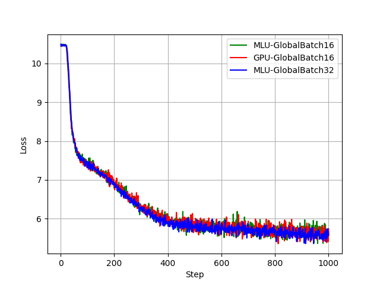

# 模型简介

GLM (General Language Model) 是一个全新的预训练框架，打破BERT和GPT的瓶颈。
单一GLM模型在语言理解和生成任务方面取得了最佳结果，并且超过了对相同数据量进行训练的常见预训练模型（例如BERT，RoBERTa和T5）。

# 测试目标与结果汇总

本报告主要完成第一阶段目标，即2021.12.31目标。具体信息如下:


+------------+------------------------------------------------------------------------------------------+
| 关键阶段   | 关键目标                                                                                 |
+============+==========================================================================================+
| 2021.12.31  | * GLM-Base 网络在 370X8 单卡性能达到 V100 的 80%，2 机 16 卡达到 V100 的 100%            |
|             | * GLM-XXLarge 网络在370X8上性能基本达到同配置下 V100的50%                                |
|             | * GLM-XXLarge 精度完成前 1000 iteration 在 Stage2 配置下 MLU 和 GPU 的 LOSS 下降曲线对比 |
+------------+------------------------------------------------------------------------------------------+


## 主要完成工作

2021年9月至2021年12月,我们主要完成了以下工作:

1. 在 370X8 平台上适配智源的悟道文汇系列网络：GLM-Base、GLM-XXLarge

2. GLM-Base 性能优化，单卡达到 V100 80%，2 机 16 卡性能与 V100 齐平

3. GLM-XXLarge 在 2 机 16 卡跑通，性能超过同配置下 V100 的 50%，精度完成前1000 Steps 在 Stage2 配置下 MLU 和 GPU 的 LOSS 下降曲线对比

## 测试结果摘要

性能测试结果显示：

1. GLM-Base 模型在 1 卡情况下 MLU370X8 吞吐性能达到 V100 的 83%，8 卡情况下吞吐达到 V100 的 98%
2. GLM-Base 模型在 2 机 16 卡情况下，MLU370X8 吞吐性能是 V100 的 1.39 倍，主要原因是 GPU 采用低速网络配置，MLU 采用高速网络配置和 RDMA
3. GLM-XXLarge 模型在 2 机 16 卡情况下，MLU370X8 吞吐性能是 V100 的 2.23 倍，主要原因是 GPU 采用低速网络配置，MLU 采用高速网络配置和 RDMA

精度测试结果显示：

* GLM-Base 的 2 机 16 卡 from scratch 测试，GPU 和 MLU 的 PPL 值分别为 16.947/16.991， LOSS 曲线对比，MLU 和 GPU 的 LOSS 下降基本一致，说明 GPU/MLU 在相同配置下，精度一致。
* GLM-XXLarge 的 2 机 16 卡 LOSS 曲线对比，MLU 和 GPU 的 LOSS 下降基本一致。

# 测试方法

## 软硬件平台

单机 8 卡 MLU 平台与单机 8 卡 GPU 平台配置信息如下，采用双机 16 卡进行测试：

+--------------+-------------------------------------------+-----------------------------------------+
|              | GPU                                       | MLU                                     |
+==============+===========================================+=========================================+
| CPU          | 2 x Intel (R) Xeon(R) 6230R CPU @ 2.10GHz | 2 x Intel(R) Xeon(R) 6230 CPU @ 2.10GHz |
+--------------+-------------------------------------------+-----------------------------------------+
| Memory       | 512 GB                                    | 512 GB                                  |
+--------------+-------------------------------------------+-----------------------------------------+
| Device       | 8 x V100-PCIE (32GB)                      | 8 x MLU370-X8 (48GB)                    |
+--------------+-------------------------------------------+-----------------------------------------+
| 机内卡间通信   | PCIE Gen3                                 | PCIE Gen3                               |
|              |                                           | 每 4 张卡配置 1 张 MLU-LINK 交火卡         |
+--------------+-------------------------------------------+-----------------------------------------+
| 机间卡间通信   | 10 Gbps Ethernet                          | 100 Gbps Infiniband                     |
|              |                                           | RMDA                                    |
+--------------+-------------------------------------------+-----------------------------------------+

GLM-Base 性能测试环境配置包括：

* GPU：1 卡、8 卡、16 卡
* MLU：1 卡、8 卡、16 卡

GLM-XXLarge 性能测试环境：

* GPU：16 卡
* MLU：16 卡

软件配置信息：

+----------------------------+--------------------------+
| GPU                        | MLU                      |
+============================+==========================+
| Driver Version: 460.32.03\ | Driver Version: 4.15.13\ |
| CUDA Version: 11.2\        | Neuware Version: 2.3.0\  |
| torch：1.9.0a0+df837d0\    | torch：1.6.0             |
| deepspeed：0.3.16          |                          |
+----------------------------+--------------------------+

## 测试负载

采用 [GLM](https://github.com/THUDM/GLM) 开源模型 GLM-Base 和 GLM-XXLarge。模型相关信息如下：

+-------------+---------+----------------------------+
|  Model      | 参数量  |  测试数据集                |
+=============+=========+============================+
| GLM-Base    | 110M    | Bookscorpus 和 Wikicorpus  |
+-------------+---------+----------------------------+
| GLM-XXLarge | 10B     |  Pile                      |
+-------------+---------+----------------------------+

在本报告中将对 GLM-Base, GLM-XXLarge 的优化过程和测试结果进行阐述，同时简要说明其它任务的当前适配进展。此次测试范围包含：

* MLU370-X8 平台 1 机 1 卡、1 机 8 卡、2 机 16 卡的性能和精度
* 数据类型为 FP16

## 测试指标

性能指标：

* 吞吐：每个逻辑卡单位时间完成的输入数据量，单卡双芯按照双逻辑卡的总吞吐进行计算。

精度指标：

* LOSS：当前迭代运行时，前向完成计算后与目标值的误差
* from scratch 精度：完成目标代数训练后得到的模型进行推理得到的误差值

## 测试方法

名词解释：

* DP：数据并行度
* MP：Tensor 模型并行度
* dev (Dev Number)：为物理卡数（需要注意 MLU370X8 为 2 芯，软件可见为 2 逻辑卡）
* oc (Overlap Communication)：DeepSpeed 采用多 Queue 运行提高性能，对应设置为 DeepSpeed 的 Config 文件中的 `"overlap_comm": true`
* ca (Checkpoint Activation)：开启重计算，对应设置为 `--checkpoint-activations   --deepspeed-activation-checkpointing`
* ZeRO：DeepSpeed 中 ZeRO 的模式，包括
	* none：不行 ZeRO 优化
	* stage-1：对优化器状态进行分区优化
	* stage-2：对优化器状态和梯度进行分区优化
* latency/E2E：平均完成一次 step 所需要花费的时间。计算方法：运行 200 个 steps，统计 50-150 每个 step 的平均延迟。
* throughput (words per second, wps)：每秒处理的单词数量。计算方法：每个 step 的总输入数据量/平均延迟。

参数配置：

+---------+----------+-----------------------------+----------+----------+
| GLM     | DataType | Config                      |  MP      | DP       |
+=========+==========+=============================+==========+==========+
| Base    | fp16     | [ds_block_base.sh][s1]      | 1        | 可配置    |
+---------+----------+-----------------------------+----------+----------+
| XXLarge | fp16     | [config_block_10B.json][s2] | 可配置    | 4        |
+---------+----------+-----------------------------+----------+----------+

[s1]: https://github.com/THUDM/GLM/blob/main/config/ds_block_base.sh
[s2]: https://github.com/THUDM/GLM/blob/main/config/ds_block_10B.sh

测试对比 GPU 和 MLU 精度时，模型的数据并行度设置相同，保证 Total Batch Size 相同。
测试性能时，GLM-Base 模型的数据并行度按照芯片数进行相应配置，例如 1 卡双芯 X8 的 DP 设置为 2，对应 GPU 单卡的 DP 设置为 1。
GLM-XXLarge 模型由于参数量大，受限总内存大小 DP 设置为 4，双机 16 卡情况下，GPU 的 MP 设置为 4，MLU370X8 的 MP 设置为 8。

# 测试结果

## 性能测试

+---------+-------+-------+-----+-----+------------+----------+-------+----------+-------+---------+
|         |       |       |     |     | Dsp Config | V100     |       | MLUX8    |       | Compare |
+=========+=======+=======+=====+=====+============+==========+=======+==========+=======+=========+
| GLM     | BS/DP | DP    | MP  | Dev | oc/ca/ZeRO | E2E (ms) | wps   | E2E (ms) | wps   | MLU/GPU |
+---------+-------+-------+-----+-----+------------+----------+-------+----------+-------+---------+
| Base    | 16    | 1/2   | 1   | 1   | F/F/N      | 312      | 51.28 | 750.5    | 42.6  | 0.83    |
+---------+-------+-------+-----+-----+------------+----------+-------+----------+-------+---------+
| Base    | 16    | 8/16  | 1   | 8   | F/F/N      | 396.6    | 322.7 | 807.1    | 317.2 | 0.98    |
+---------+-------+-------+-----+-----+------------+----------+-------+----------+-------+---------+
| Base    | 16    | 16/32 | 1   | 16  | F/F/N      | 629.41*  | 406.7*| 900      | 568.8 | 1.39    |
+---------+-------+-------+-----+-----+------------+----------+-------+----------+-------+---------+
| XXLarge | 21    | 4     | 4/8 | 16  | F/T/Stage2 | 49006*   | 1.714*| 17932.5  | 4.68  | 2.23    |
+---------+-------+-------+-----+-----+------------+----------+-------+----------+-------+---------+

**备注**：

* oc/ca/ZeRO 对应的是 Deepspeed 的配置,表示 overlap\_comm, checkpoint\_activation, ZeRO 的 Stage，F/F/N 表示 False/False/None ，即无 overlap\_comm ， 无 checkpoint\_activation ， 无 ZeRO 的 Stage

* GPU 双机 16 卡数据采用的是 Ethernet 机间卡间通信， MLU 双机 16 卡数据采用的是 Infiniband 机间卡间通信， 并使用了 RDMA ，故 MLU 的性能明显高于 GPU

结论：

1. GLM-Base 模型在 1 卡情况下 MLU370X8 吞吐性能达到 V100 的 83%，8 卡情况下吞吐达到 V100 的 98%。
2. GLM-Base 模型在 2 机 16 卡情况下，MLU370X8 吞吐性能是 V100 的 1.39 倍，主要原因是 GPU 采用低速网络配置，MLU 采用高速网络配置和 RDMA。
3. GLM-XXLarge 模型在 2 机 16 卡情况下，MLU370X8 吞吐性能是 V100 的 2.23 倍，主要原因是 GPU 采用低速网络配置，MLU 采用高速网络配置和 RDMA。

## 精度测试

**GLM Base**

from scratch 精度：

GLM-Base from scratch 精度配置 GPU/MLU 在总 BatchSize 上对齐， 从随机初始化的模型开始， 总共运行的 Batch 数量相当于单 GPU 使用 BatchSize 16 跑 150000 代的 Batch 数量。

GPU 使用双机 16 卡，DP=16，每个 DP 的 BatchSize 为 16，跑 9375 代。

MLU 使用双机 16 卡，DP=32，每个 DP 的 BatchSize 为 8，跑 9375 代。


+-----+----------------------------------------------+----------------------------------------------+
|     | GPU                                          | MLU                                          |
+=====+==============================================+==============================================+
| PPL | 16.947                                       | 16.991                                       |
+-----+----------------------------------------------+----------------------------------------------+
| log | [gpu_deepspeed_base_log_12_31_12_39.txt][l1] | [mlu_deepspeed_base_log_12_31_21_59.txt][l2] |
+-----+----------------------------------------------+----------------------------------------------+

[l1]: ./gpu_deepspeed_base_log_12_31_12_39.txt
[l2]: ./mlu_deepspeed_base_log_12_31_21_59.txt

前 1000 steps 的 LOSS 下降曲线：

{width=50%}

```bash


```


**GLM XXLarge**

前 1000 steps 的 LOSS 下降曲线：


{width=75%}


前 1000 steps 精度：

GLM-XXLarge 训练配置 GPU/MLU 在总 BatchSize 上对齐， 目前仅运行前 1000 代。

GPU 使用双机 16 卡，DP=4，MP=4，每个 DP 的 BatchSize 为 21，全局 BatchSize 为 84，跑 1000 代。

MLU 使用双机 16 卡，DP=4，MP=8，每个 DP 的 BatchSize 为 21，全局 BatchSize 为 84，跑 1000 代。


+------+-----------------------------------+-----------------------------------+
|      | GPU                               | MLU                               |
+======+===================================+===================================+
| Loss | 5.808                             | 5.693                             |
+------+-----------------------------------+-----------------------------------+
| log  | [glm-xxlarge-gpu-dp4-mp4.txt][l3] | [glm-xxlarge-mlu-dp4-mp8.txt][l4] |
+------+-----------------------------------+-----------------------------------+


[l3]: ./glm-xxlarge-gpu-dp4-mp4.txt

[l4]: ./glm-xxlarge-mlu-dp4-mp8.txt


结论：

1. GLM-Base 的 2 机 16 卡 from scratch 测试，GPU 和 MLU 的 PPL 指分别为 16.947/16.991，MLU 和 GPU 的 LOSS 下降基本一致，GPU/MLU 在相同配置下，精度一致。
2. GLM-XXLarge 的 2 机 16 卡 LOSS 曲线对比，MLU 和 GPU 的 LOSS 下降基本一致。


# 复现方法

为了避免环境不对齐引发的问题,复现环境直接采用docker的形式。docker包括了CTR2.3发布环境,安装了deepspeed,并包含了适配过MLU的GLM代码。只需要设置docker多机互联,运行docker中既有脚本即可复现所有上述结果。

## 创建docker swarm

创建docker swarm
用于多机互联,\*.\*.\*.\*中需要设置为swarm中主要机器的IP地址

```bash
docker swarm init --advertise-addr *.*.*.*
docker swarm join-token (worker/manager)
```

## 创建docker overlay network

创建overlay network
用于构建多container互联.其中DOCKER\_NETWORK设置为自定义的network名称,如glm\_multi\_node

```bash
docker network create -d overlay ${DOCKER_NETWORK}
```

## 启动docker

启动docker,网络指定为刚刚创建的network,其中 \$<span>GLM\_DOCKER</span>
需要改为我们提供的docker名


```bash
export MY_CONTAINER="glm-docker-swarm-worker"
export DOCKER_NETWORK=${DOCKER_NETWORK}
export GLM_DOCKER=$GLM_DOCKER
docker run -it --shm-size '100gb' --network=${DOCKER_NETWORK} \
-v /datasets:/datasets \
--device /dev/cambricon_dev0 --device /dev/cambricon_dev1 --device /dev/cambricon_dev2 --device /dev/cambricon_dev3 \
--device /dev/cambricon_dev4 --device /dev/cambricon_dev5 --device /dev/cambricon_dev6 --device /dev/cambricon_dev7 \
--device /dev/cambricon_dev8 --device /dev/cambricon_dev9 --device /dev/cambricon_dev10 --device /dev/cambricon_dev11 \
--device /dev/cambricon_dev12 --device /dev/cambricon_dev13 --device /dev/cambricon_dev14 --device /dev/cambricon_dev15 \
--device /dev/cambricon_ctl -it --name $MY_CONTAINER -v /usr/bin/cnmon:/usr/bin/cnmon --user root --privileged \
${GLM_DOCKER} /bin/bash
```


启动 GPU 多 container 的脚本与 MLU 类似

```bash
docker run -itd \
           --name=${MY_CONTAINER} \
           --network=${DOCKER_NETWORK} \
           --pid=host \
           --privileged \
           -v /{dataset_path_on_host}:/{dataset_path_in_container} \
           -v /{work_dir_on_host}:/{work_dir_in_container} \
           ${GLM_DOCKER} \
           /bin/bash
```

要进入容器，请在 docker overlay 网络 master 节点运行

```bash
docker exec -it ${MY_CONTAINER} /bin/bash
```


## 激活虚拟环境

进入 MLU 容器后要激活虚拟环境

```bash
source /torch/venv3/pytorch/bin/activate
```

GPU 容器进入后无需激活环境。

## 配置 GLM-Base数据集

GLM-Base 数据集请修改 /glm/data_utils/corpora.py 中的 class BertBaseData(BertData) 类
配置其中的 PATH 变量为您数据集的位置

## 配置 hostfile.txt

运行 `Base` 网络的多机或者 `XXLarge` 网络需要配置 `hostfile.txt`，在获取到每个 node 上容器的 ip 地址后，按照如下格式编辑 `hostfile.txt`

```text
xxx.xxx.xxx.xxx slots={num_gpus_per_node}
xxx.xxx.xxx.xxx slots={num_gpus_per_node}
```
仓库中已给出 `hostfile.txt` 的示例。

## 配置 .deepspeed_env

在 GLM 文件夹下存在隐藏配置文件 `.deepspeed_env`，若您想要运行 GLM_Base 多机或者 GLM_XXLarge，除了需要安装 deepspeed 外，还需要几步来配置 deepspeed 启动时的环境变量从主机转发至从机以保证 `GLM-XXLarge` 网络正常运行。

配置 `PATH` 和 `LD_LIBRARY_PATH` 以确保每个 node 容器可以找到正确的 MLU/GPU 环境，运行以下指令，
```bash
echo "PATH=${PATH}" >> .deepspeed_env
echo "LD_LIBRARY_PATH=${LD_LIBRARY_PATH}" >> .deepspeed_env
```
若运行的是 MLU 脚本，还需要执行
```bash
echo "NEUWARE_HOME=${NEUWARE_HOME}" >> .deepspeed_env
```

配置数据集路径，如修改`.deepspeed_env` 中的
```bash
PILE_DATASET_PATH=/algo/datasets_training/pile/train_00/
LID_176_PATH=/algo/datasets_training/pile/glm/fastText/lid.176.bin
```
完成后，将 `.deepspeed_env` 拷贝至 `~/` 下即可。

## 运行代码


切换到GLM仓库所在的目录
    pushd /glm

运行 bash scripts/${script\_name} 即可复现对应结果。

对于性能/精度共有 6 种配置,对应的 GPU / MLU 脚本已由表列出

+-------------+------+-------+------+-----+------------+------------------+------------------+
| GLM         |BS/DP | DP    | MP   | Dev | oc/ca/ZeRO | GPU script       | MLU script       |
+=============+======+=======+======+=====+============+==================+==================+
| Base Perf   | 16   | 1/2   | 1    | 1   | F/F/N      | gpu/base_2.sh    | mlu/base_2_p.sh  |
+-------------+------+-------+------+-----+------------+------------------+------------------+
| Base Perf   | 16   | 8/16  | 1    | 8   | F/F/N      | gpu/base_8.sh    | mlu/base_16_p.sh |
+-------------+------+-------+------+-----+------------+------------------+------------------+
| Base Perf   | 16   | 16/32 | 1    | 16  | F/F/N      | gpu/base_16.sh   | mlu/base_32.sh   |
+-------------+------+-------+------+-----+------------+------------------+------------------+
| XXLarge Perf|  21  | 4     | 4/8  | 16  | F/T/Stage2 | gpu/large_perf.sh| mlu/large.sh     |
+-------------+------+-------+------+-----+------------+------------------+------------------+
| Base Acc    | 16/8 | 16/32 | 1    | 1   | F/F/N      | gpu/base_2_a.sh  | mlu/base_32.sh   |
+-------------+------+-------+------+-----+------------+------------------+------------------+
| XXLarge Acc | 21   | 4     | 4/8  | 16  | F/T/Stage2 | gpu/large_acc.sh | mlu/large.sh     |
+-------------+------+-------+------+-----+------------+------------------+------------------+

**提示**：如果运行 GPU 脚本提示 `[ERROR]: import torch_mlu failed`，属于正常现象，仅表示当前 import 的 torch 不是 `torch_mlu`，并不代表运行失败。


