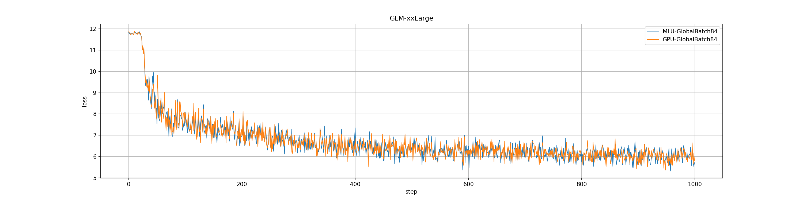

# 模型简介

GLM (General Language Model) 是一个全新的预训练框架，打破BERT和GPT的瓶颈。
单一GLM模型在语言理解和生成任务方面取得了最佳结果，并且超过了对相同数据量进行训练的常见预训练模型（例如BERT，RoBERTa和T5）。

# 测试目标与结果汇总

本报告主要完成第二阶段的目标，即2022.3.31前的目标。具体信息如下:


+------------+-------------------------------------------------------------------------------------------+
| 关键阶段   | 关键目标                                                                                  |
+============+===========================================================================================+
| 2021.12.31 | * GLM-Base 网络在 370X8 单卡性能达到 V100 的 80%，2 机 16 卡达到 V100 的 100%             |
|            | * GLM-XXLarge 网络在370X8上性能基本达到同配置下 V100的50%                                 |
|            | * GLM-XXLarge 精度完成前 1000 iteration 在 Stage2 配置下 MLU 和 GPU 的 LOSS 下降曲线对比  |
+------------+-------------------------------------------------------------------------------------------+
| 2022.03.31 | * GLM-XXLarge 网络2机16卡的计算效率达到V100的100%                                         |
+------------+-------------------------------------------------------------------------------------------+


## 主要完成工作

2021年9月至2021年12月,我们主要完成了以下工作:

1. 在 370X8 平台上适配智源的悟道文汇系列网络：GLM-Base、GLM-XXLarge

2. GLM-Base 性能优化，单卡达到 V100 80%，2 机 16 卡性能与 V100 齐平

3. GLM-XXLarge 在 2 机 16 卡跑通，性能超过同配置下 V100 的 50%，精度完成前1000 Steps 在 Stage2 配置下 MLU 和 GPU 的 LOSS 下降曲线对比

2022年1月至2022年3月,我们主要完成了以下工作:

1. 支持 DeepSpeed 中新特性： 支持多Stream 和 Contiguous_Gradients 特性

2. 优化GLM-XXLarge网络的算子性能：逐层比较算子在MLU和GPU的性能， 找出性能差的算子进行优化

3. 优化GLM-XXLarge网络通信性能：分析网络中所有通信算子的 Pattern， 并进行优化

## 测试结果摘要

性能测试结果显示：

GLM-XXLarge 模型在 2 机 16 卡情况下，MLU370X8 的计算效率是19.7%，GPUV100的计算效率是3.9%

精度测试结果显示：

* GLM-XXLarge 的 2 机 16 卡 LOSS 曲线对比，MLU 和 GPU 的 LOSS 下降基本一致。

# 测试方法

## 软硬件平台

单机 8 卡 MLU 平台与单机 8 卡 GPU 平台配置信息如下，采用双机 16 卡进行测试：

+--------------+-------------------------------------------+----------------------------------------------+
|              | GPU                                       | MLU                                          |
+==============+===========================================+==============================================+
| CPU          | 2 x Intel (R) Xeon(R) 6230R CPU @ 2.10GHz | 2 x Intel(R) Xeon(R) Gold 6330 CPU @ 2.00GHz |
+--------------+-------------------------------------------+----------------------------------------------+
| Memory       | 512 GB                                    | 512 GB                                       |
+--------------+-------------------------------------------+----------------------------------------------+
| Device       | 8 x V100-PCIE (32GB)                      | 8 x MLU370-X8 (48GB)                         |
+--------------+-------------------------------------------+----------------------------------------------+
| 机内卡间通信 | PCIE Gen3                                 | PCIE Gen4\                                   |
|              |                                           | 每 4 张卡配置 1 张 MLU-LINK 交火卡           |
+--------------+-------------------------------------------+----------------------------------------------+
| 机间卡间通信 | 10 Gbps Ethernet                          | 200 Gbps Infiniband\                         |
|              |                                           | RMDA                                         |
+--------------+-------------------------------------------+----------------------------------------------+

GLM-XXLarge 性能测试环境：

* GPU：16 卡
* MLU：16 卡

软件配置信息：

+----------------------------+--------------------------+
| GPU                        | MLU                      |
+============================+==========================+
| Driver Version：460.32.03\ | Driver Version：4.20.5\  |
| CUDA Version：11.2\        | Neuware Version：2.7.2\  |
| torch：1.9.0a0+df837d0\    | torch：1.6.0\            |
| deepspeed：0.3.16          | deepspeed：0.3.13        |
+----------------------------+--------------------------+

## 测试负载

采用 [GLM](https://github.com/THUDM/GLM) 开源模型 GLM-XXLarge。模型相关信息如下：

+-------------+---------+----------------------------+
|  Model      | 参数量  |  测试数据集                |
+=============+=========+============================+
| GLM-XXLarge | 10B     |  Pile                      |
+-------------+---------+----------------------------+

在本报告中将对 GLM-XXLarge 的优化过程和测试结果进行阐述，同时简要说明其它任务的当前适配进展。此次测试范围：

* MLU370-X8 平台 2 机 16 卡的性能和精度
* 数据类型为 FP16

## 测试指标

名词解释：

* B (batch_size)： 单次训练的输入个数
* s (sequence_length)： 每个句子中最大有多少个单词（tokens）
* l (transformer_layers)：transformer的层数
* h (hidden_size): 表示单词的数组的长度
* V (vocabulary_dimension): 词表中tokens的个数
* dev (Dev Number)：为物理卡数（需要注意 MLU370X8 为 2 芯，软件可见为 2 逻辑卡）
* e2e： 单次训练所需要的时间
* cf (calculate_force)： 单张物理卡每秒进行浮点计算的次数。其中MLU370-X8的算力为96TFLOPs，GPU-V100的算力为112TFLOPs
* 理论模型算力：模型理论上所消耗的算力。由Nvidia在《Efficient Large-Scale Language Model Training on GPU Clusters Using Megatron-LM》论文中提出
    * 在使用重计算的情况下其计算公式为：$96\times B\times s\times l\times h^2(1+\frac{s}{6\times h}) + \frac{V}{16\times l\times h}$
* 理论峰值算力：理论上所有设备在模型单词迭代的时间内所能提供的算力
    * 其计算公式为：$dev \times e2e \times cf$

性能指标：

* 计算效率：理论模型算力 / 理论峰值算力

精度指标：

* LOSS：当前迭代运行时，前向完成计算后与目标值的误差
* from scratch 精度：完成目标代数训练后得到的模型进行推理得到的误差值

## 测试方法

名词解释：

* DP：数据并行度
* MP：Tensor 模型并行度
* oc (Overlap Communication)：DeepSpeed 采用多 Queue 运行提高性能，对应设置为 DeepSpeed 的 Config 文件中的 `"overlap_comm": true`
* ca (Checkpoint Activation)：开启重计算，对应设置为 `--checkpoint-activations   --deepspeed-activation-checkpointing`
* ZeRO：DeepSpeed 中 零冗余优化器，包括
	* none：不行 ZeRO 优化
	* stage-1：对优化器状态进行分区优化
	* stage-2：对优化器状态和梯度进行分区优化
* latency/E2E：平均完成一次 step 所需要花费的时间。计算方法：运行 200 个 steps，统计 50-150 每个 step 的平均延迟。
* throughput (words per second, wps)：每秒处理的单词数量。计算方法：每个 step 的总输入数据量/平均延迟。

参数配置：

+---------+----------+-----------------------------+----------+----------+
| GLM     | DataType | Config                      |  MP      | DP       |
+=========+==========+=============================+==========+==========+
| XXLarge | fp16     | [config_block_10B.json][s]  | 可配置   | 4        |
+---------+----------+-----------------------------+----------+----------+

[s]: https://github.com/THUDM/GLM/blob/main/config/ds_block_10B.sh

测试对比 GPU 和 MLU 精度时，模型的数据并行度设置相同，保证 Total Batch Size 相同。
测试性能时，GLM-XXLarge 模型的数据并行度按照芯片数进行相应配置，例如 1 卡双芯 X8 的 DP 设置为 2，对应 GPU 单卡的 DP 设置为 1。
GLM-XXLarge 模型由于参数量大，受限总内存大小 DP 设置为 4，双机 16 卡情况下，GPU 的 MP 设置为 4，MLU370X8 的 MP 设置为 8。

# 测试结果

## 性能测试

+---------+-------+-------+-----+-----+------------+----------+-------+----------+-------+---------+
|         |       |       |     |     | Dsp Config | V100     |       | MLUX8    |       | Compare |
+=========+=======+=======+=====+=====+============+==========+=======+==========+=======+=========+
| GLM     | BS/DP | DP    | MP  | Dev | oc/ca/ZeRO | E2E (ms) | wps   | E2E (ms) | wps   | MLU/GPU |
+---------+-------+-------+-----+-----+------------+----------+-------+----------+-------+---------+
| XXLarge | 21    | 4     | 4/8 | 16  | F/T/Stage2 | 49006    | 1.714 | 11384.81 | 7.38  | 4.31    |
+---------+-------+-------+-----+-----+------------+----------+-------+----------+-------+---------+

**备注**：

* oc/ca/ZeRO 对应的是 Deepspeed 的配置,表示 overlap\_comm, checkpoint\_activation, ZeRO 的 Stage，F/F/N 表示 False/False/None ，即无 overlap\_comm ， 无 checkpoint\_activation ， 无 ZeRO 的 Stage

* GPU 双机 16 卡数据采用的是 Ethernet 机间卡间通信， MLU 双机 16 卡数据采用的是 Infiniband 机间卡间通信， 并使用了 RDMA ，故 MLU 的性能明显高于 GPU

结论：

GLM-XXLarge 模型在 2 机 16 卡情况下，MLU370X8 的计算效率是 V100 的 5.05 倍。

## 精度测试

**GLM XXLarge**

前 1000 steps 的 LOSS 下降曲线：


{width=75%}


前 1000 steps 精度：

GLM-XXLarge 训练配置 GPU/MLU 在总 BatchSize 上对齐， 目前仅运行前 1000 代。

GPU 使用双机 16 卡，DP=4，MP=4，每个 DP 的 BatchSize 为 21，全局 BatchSize 为 84，跑 1000 代。

MLU 使用双机 16 卡，DP=4，MP=8，每个 DP 的 BatchSize 为 21，全局 BatchSize 为 84，跑 1000 代。


+------+-----------------------------------+-----------------------------------+
|      | GPU                               | MLU                               |
+======+===================================+===================================+
| Loss | 5.808                             | 5.707                             |
+------+-----------------------------------+-----------------------------------+
| log  | [glm-xxlarge-gpu-dp4-mp4.txt][l1] | [glm-xxlarge-mlu-dp4-mp8.txt][l2] |
+------+-----------------------------------+-----------------------------------+


[l1]: ./glm-xxlarge-gpu-dp4-mp4.txt

[l2]: ./glm-xxlarge-mlu-dp4-mp8.txt


结论：

GLM-XXLarge 的 2 机 16 卡 LOSS 曲线对比，MLU 和 GPU 的 LOSS 下降基本一致。


# 复现方法

为了避免环境不对齐引发的问题,复现环境直接采用docker的形式。docker包括了CTR2.3发布环境,安装了deepspeed,并包含了适配过MLU的GLM代码。只需要设置docker多机互联,运行docker中既有脚本即可复现所有上述结果。

## 创建docker swarm

创建docker swarm
用于多机互联,\*.\*.\*.\*中需要设置为swarm中主要机器的IP地址

```bash
# node0 , 第一个指令将 node0 设置成集群管理者，第二个指令打印加入该集群的指令，供其他 node 使用
> docker swarm init --advertise-addr *.*.*.*
> docker swarm join-token (worker/manager)
# node1， 从 node0 获取加入集群的指令，执行该指令加入集群
docker swarm join --token  $token_id
```

## 创建docker overlay network

创建overlay network
用于构建多container互联.其中DOCKER\_NETWORK设置为自定义的network名称,如glm\_multi\_node

```bash
docker network create -d overlay --attachable ${DOCKER_NETWORK}
```

## 启动docker

启动docker,网络指定为刚刚创建的network,其中 \$<span>GLM\_DOCKER</span>
需要改为我们提供的docker名


```bash
export MY_CONTAINER="glm-docker-swarm-worker"
export DOCKER_NETWORK=${DOCKER_NETWORK}
export GLM_DOCKER=$GLM_DOCKER
docker run -it --shm-size '100gb' --network=${DOCKER_NETWORK} \
-v /datasets:/datasets \
--device /dev/cambricon_dev0 --device /dev/cambricon_dev1 --device /dev/cambricon_dev2 --device /dev/cambricon_dev3 \
--device /dev/cambricon_dev4 --device /dev/cambricon_dev5 --device /dev/cambricon_dev6 --device /dev/cambricon_dev7 \
--device /dev/cambricon_dev8 --device /dev/cambricon_dev9 --device /dev/cambricon_dev10 --device /dev/cambricon_dev11 \
--device /dev/cambricon_dev12 --device /dev/cambricon_dev13 --device /dev/cambricon_dev14 --device /dev/cambricon_dev15 \
--device /dev/cambricon_ctl -it --name $MY_CONTAINER -v /usr/bin/cnmon:/usr/bin/cnmon --user root --privileged \
${GLM_DOCKER} /bin/bash
```


启动 GPU 多 container 的脚本与 MLU 类似

```bash
docker run -itd \
           --name=${MY_CONTAINER} \
           --network=${DOCKER_NETWORK} \
           --pid=host \
           --privileged \
           -v /{dataset_path_on_host}:/{dataset_path_in_container} \
           -v /{work_dir_on_host}:/{work_dir_in_container} \
           ${GLM_DOCKER} \
           /bin/bash
```

要进入容器，请在 docker overlay 网络 master 节点运行

```bash
docker exec -it ${MY_CONTAINER} /bin/bash
```

## 开启 SSH 服务

利用 Cambricon DeepSpeed 框架进行多机多卡训练时，要求不同节点间能免密进行 SSH 通信，因此需要开启 SSH 服务。

```bash
# 生成SSH的私钥和公钥
> ssh-keygen
# 将公钥拷贝到自身服务器的 authorized_keys 文件中
> cat ~/.ssh/id_rsa.pub >> ~/.ssh/authorized_keys
# 将公钥拷贝到其他服务器的 authorized_keys 文件中
> echo "$rsa_public" >> ~/.ssh/authorized_keys

#开启 SSH 服务。
> service ssh start
```


## 激活虚拟环境

进入 MLU 容器后要激活虚拟环境

```bash
> source /torch/venv3/pytorch/bin/activate
```

GPU 容器进入后无需激活环境。


## 配置 hostfile.txt

运行多机 `GLM-XXLarge` 网络需要配置 `hostfile.txt`，在获取到每个 node 上容器的 ip 地址后，按照如下格式编辑 `hostfile.txt`

```text
xxx.xxx.xxx.xxx slots={num_gpus_per_node}
xxx.xxx.xxx.xxx slots={num_gpus_per_node}
```
仓库中已给出 `hostfile.txt` 的示例。

## 配置 .deepspeed_env

在 GLM 文件夹下存在隐藏配置文件 `.deepspeed_env`，若您想要运行 GLM_XXLarge 多机，需要配置 deepspeed 启动时的环境变量保证 `GLM-XXLarge` 网络正常运行。

配置 `PATH` 和 `LD_LIBRARY_PATH` 以确保每个 node 容器可以找到正确的 MLU/GPU 环境，运行以下指令，
```bash
> echo "PATH=${PATH}" >> .deepspeed_env
> echo "LD_LIBRARY_PATH=${LD_LIBRARY_PATH}" >> .deepspeed_env
```
若运行的是 MLU 脚本，还需要执行
```bash
> echo "NEUWARE_HOME=${NEUWARE_HOME}" >> .deepspeed_env
```

配置数据集路径，如修改`.deepspeed_env` 中的
```bash
PILE_DATASET_PATH=/algo/datasets_training/pile/train_00/
LID_176_PATH=/algo/datasets_training/pile/glm/fastText/lid.176.bin
```
完成后，将 `.deepspeed_env` 拷贝至 `~/` 下即可。

## 运行代码


切换到GLM仓库所在的目录

运行 bash scripts/${script\_name} 即可复现对应结果。

对于性能/精度共有 2 种配置,对应的 GPU / MLU 脚本已由表列出

+-------------+------+-------+------+-----+------------+------------------+------------------------+
| GLM         |BS/DP | DP    | MP   | Dev | oc/ca/ZeRO | GPU script       | MLU script             |
+=============+======+=======+======+=====+============+==================+========================+
| XXLarge Perf|  21  | 4     | 4/8  | 16  | F/T/Stage2 | gpu/large_perf.sh| ds_pretrain_mlu_10B.sh |
+-------------+------+-------+------+-----+------------+------------------+------------------------+
| XXLarge Acc | 21   | 4     | 4/8  | 16  | F/T/Stage2 | gpu/large_acc.sh | ds_pretrain_mlu_10B.sh |
+-------------+------+-------+------+-----+------------+------------------+------------------------+

**提示**：如果运行 GPU 脚本提示 `[ERROR]: import torch_mlu failed`，属于正常现象，仅表示当前 import 的 torch 不是 `torch_mlu`，并不代表运行失败。

