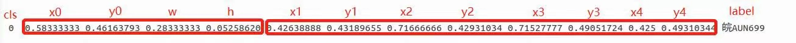
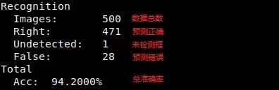
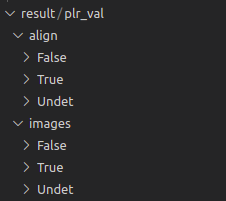

# License Plate Detection & Recognition(LPDR)
## 预训练模型
在./weights中提供了检测及识别预训练模型；  
识别模型分别使用仅CCPD增广数据训练模型，以及CCPD+自标注LPR增广数据训练模型，在自标注LPR数据上500张测试集的精度对比如下：  

Models  | True  | Undetected  | False  | Acc(%) 
----- | ----- | ----- | ----- | ----- |
Det+Rec_CCPD  | 389  | 1  | 110  |  77.8 
Det+Rec_CCPD&LPR  | 471  | 1  | 28  |  94.2 
  
## 数据转换
数据ground truth文件格式如下：

- cls: 检测类别，仅检测车牌分类，此项为固定值0；
- x0,y0,w,h: 分别为框中心坐标及框的长、高；
- x1~y4: 四边形框的四个顶点坐标，左上起始顺时针；
- label: 车牌号码；
- 注：以上坐标为归一化后的坐标，即x/im_w或w/im_w，y/im_h或h/im_h;
### CCPD转换
```
python tools/datacvt_ccpd.py \
--val_ratio 0.05 \
--imgs_path 【path/to/ccpd】 \
--det_save /workspace/LPDR/Database/DB_Detection \
--rec_save /workspace/LPDR/Database/DB_Recognition
```
- val_ratio: 分离的验证集(测试集)比例;  
- imgs_path: 原始CCPD数据路径，需完整解压CCPD2019及2020，并放置于同一目录  
- det_save:  转换后检测训练数据存储路径;  
- rec_save:  转换后识别训练数据存储路径;  
  
### 云平台自标注数据转换
此脚本可完成云平台自标注数据到检测训练数据及识别增广训练数据的自动转换，并可自动随机分离验证集。
```
python tools/datacvt_lpr.py \
--val_ratio 0.05 \
--idx_count 400000 \
--json_file 【path/to/label.json】 \
--imgs_path 【path/to/images】 \
--det_save /workspace/LPDR/Database/DB_Detection \
--rec_save /workspace/LPDR/Database/DB_Recognition
```
- val_ratio: 分离的验证集(测试集)比例;  
- idx_count: 本次数据转换的起始索引，需大于已有数据数量，以便于数据合并。CCPD数据量为363,753张，初始转换索引设为400000;  
- json_file: 云平台标注的json文件路径;  
- imgs_path: 标注源图像数据路径;  
- det_save:  转换后检测训练数据存储路径;  
- rec_save:  转换后识别训练数据存储路径;  
  
## 检测算法训练
```
CUDA_VISIBLE_DEVICES=0,1,2,3,4,5,6,7 \
python -m torch.distributed.launch --nproc_per_node=8 --master_addr="127.0.0.1" --master_port=1234 \
train_yolo.py \
--data_path=/workspace/LPDR/Database/DB_Detection \
--batch-size=16 \
--epochs=300
```
  
## 识别算法训练
```
CUDA_VISIBLE_DEVICES=0,1,2,3,4,5,6,7 \
python -m torch.distributed.launch --nproc_per_node=1 --nnodes=1 --node_rank=0 --master_addr="127.0.0.1"  --master_port=1234 \
train_crnn.py \
--data_path=/workspace/LPDR/Database/DB_Recognition \
--batch_size=64 \
--epochs=100
```
  
## 完整过程测试
```
python inference.py \
--det_model ./weights/model_yolo.pt \
--rec_model ./weights/model_crnn.pth \
--data_path /workspace/LPDR/Database/LPR/test \
--save_path ./result/plr_val
```
  

## 模型训练及评估
- 若为了精度进一步提升，或解决由于测试集数据量增加后导致的精度损失问题，可在加入新数据后使用上述数据转换脚本转换，并重新训练；  
- 训练epoch：检测模型约100-300个epoch，识别模型约50-100个epoch；
- 经完整测试后，输出结果如下图：  
    
- save_path存储检测结果，目录结构如下：  
    
  align内为车牌区域crop图像，images内为原图可视化结果；  
  后续还需根据Undet及False内的数据类型，经标注及转换后加入训练集中进一步训练。