​	本文档主要用于验证 Cambricon MLU(Machine Learning Units) 训练加速器的性能和功能参数。文档旨在将调优经验输出为可操作流程, 固化为可操作的手册, 进行标准化操作至少减少一部分的性能相关问题, 主要包括分布式相关内容, 包括以下三个方面:

* performance knob相关

固定脚本检查性能相关设置的 checklist

提供调节驱动相关设置/通信拓扑/通信介质的方法(随版本迭代)

* debug相关

通过固定的操作方式, 可以跑出一个性能下界, 用于判断性能是否符合下界预期, 不符合则属于 bug ,走 jira 流程

通过 cnperf timeline, 首先了解如何获取一个正常/合理的 timeline 情况, 从而能够分析出哪些问题是不合理的, 定位 bug 发生的模块, 交给研发处理

* 常见问题


本手册使用思路是, 当产生多卡/多机性能问题时, 可以按照如下步骤进行排查, 细节在章节中描述:

1. 确认脚本运行正确, 需检查环境变量无误, 此处参考 "performance knob 相关" 的 "固定脚本检查性能相关设置的 checklist" 

2. 在固定卡数下, 有默认的最优通信拓扑/介质, 需确认已使用了最快的传输方式, 此处参考 "performance knob 相关" 的 "环境变量调整"

3. 计算通信完全无重叠情况下, 利用工具估算时间, 与网络实际耗时比对, 从而定位是否是通信产生了 bug, 此处参考 "debug 相关" 的 "耗时下界估算"

4. 通过 cnperf 工具, 抓取 timeline, 定位问题产生的模块, 找对应模块研发解决问题, 此处参考 "debug 相关" 的 "cnperf 定位问题"

# 版权声明

## 免责声明

中科寒武纪科技股份有限公司（下称“寒武纪”）不代表、担保（明示、暗示或法定的）或保证本文件所含信息，并明示放弃对可销售性、所有权、不侵犯知识产权或特定目的适用性做出任何和所有暗示担保，且寒武纪不承担因应用或使用任何产品或服务而产生的任何责任。寒武纪不应对因下列原因产生的任何违约、损害赔偿、成本或问题承担任何责任：（1）使用寒武纪产品的任何方式违背本指南；或（2）客户产品设计。

## 责任限制

在任何情况下，寒武纪都不对因使用或无法使用本指南而导致的任何损害（包括但不限于利润损失、业务中断和信息损失等损害）承担责任，即便寒武纪已被告知可能遭受该等损害。尽管客户可能因任何理由遭受任何损害，根据寒武纪的产品销售条款与条件，寒武纪为本指南所述产品对客户承担的总共和累计责任应受到限制。

## 信息准确性

本文件提供的信息属于寒武纪所有，且寒武纪保留不经通知随时对本文件信息或对任何产品和服务做出任何更改的权利。本指南所含信息和本指南所引用寒武纪文档的所有其他信息均“按原样”提供。寒武纪不担保信息、文本、图案、链接或本指南内所含其他项目的准确性或完整性。寒武纪可不经通知随时对本指南或本指南所述产品做出更改，但不承诺更新本指南。

本指南列出的性能测试和等级要使用特定芯片或计算机系统或组件来测量。经该等测试，本指南所示结果反映了寒武纪产品的大概性能。系统硬件或软件设计或配置的任何不同会影响实际性能。如上所述，寒武纪不代表、担保或保证本指南所述产品将适用于任何特定用途。寒武纪不代表或担保测试每种产品的所有参数。客户全权承担确保产品适合并适用于客户计划的应用以及对应用程序进行必要测试的责任，以期避免应用程序或产品的默认情况。

客户产品设计的脆弱性会影响寒武纪产品的质量和可靠性并导致超出本指南范围的额外或不同的情况和/或要求。

## 知识产权通知

寒武纪和寒武纪的标志是中科寒武纪科技股份有限公司在中国和其他国家的商标和/或注册商标。其他公司和产品名称应为与其关联的各自公司的商标。

本指南为版权所有并受全世界版权法律和条约条款的保护。未经寒武纪的事先书面许可，不可以任何方式复制、重制、修改、出版、上传、发布、传输或分发本指南。除了客户使用本指南信息和产品的权利，根据本指南，寒武纪不授予其他任何明示或暗示的权利或许可。未免疑义，寒武纪不根据任何专利、版权、商标、商业秘密或任何其他寒武纪的知识产权或所有权对客户授予任何（明示或暗示的）权利或许可。

* 版权声明

* © 2022 中科寒武纪科技股份有限公司保留一切权利。

# 版本记录


+--------------+-------------------------------------------+
|  文档名称    |        寒武纪Cair性能测试手册                 | 
+==============+===========================================+
| 版本号        |                 V 2.2.1                   |
+--------------+-------------------------------------------+
| 作者          |         Cambricon                        |
+--------------+-------------------------------------------+
| 修改日期      |              |today|                      |
+--------------+-------------------------------------------+


## 更新历史

* **V2.2.1**

  **更新时间**：2022年01月20号

  **更新内容**：

  - 初始版本。


# Performance Knob 

## 确认脚本运行环境无误:

pytorch/tensorflow 可以使用如下脚本检查 checklist:

+------------+--------------------------------------------------------------------------------------------------------------------------------------------------------------------+
| framework  |                                    performance check                                                                                                               | 
+============+====================================================================================================================================================================+
| pytorch    | http://gitlab.software.cambricon.com/neuware/pytorch_models/-/tree/master/Training/tools/mlu_performance_check                                                     |
+------------+--------------------------------------------------------------------------------------------------------------------------------------------------------------------+
| tensorflow | http://gitlab.software.cambricon.com/neuware/software/framework/tensorflow/tensorflow_benchmark/-/tree/master/benchmarks/cn_benchmarks/tools/mlu_performance_check |
+------------+--------------------------------------------------------------------------------------------------------------------------------------------------------------------+

performance check 脚本主要能够避免以下一些常见的导致性能不及预期的问题:

- 检查数据集路径是否挂载。
- 检查NEUWARE_HOME，CATCH_HOME， PYTORCH_HOME， VISION_HOME等环境变量是否设置。
- 检查CATCH依赖的各种MLU neuware库版本是否正确。
- 检查当前linux系统是否为Ubuntu或者Centos操作系统, 并输出对应系统版本号。
- 输出CPU型号，主频，核心数等相关信息。
- 检查CPU是否空闲，如果某个进程的CPU占用率超过5%，则会输出对应进程的PID和COMMAND。
- 检查MLU是否空闲。
- 检查MLULink，如果发现某张MLU卡有一个链路的status为Disable就会报出对应的卡号。
- 检查MLU task accelerate。
- 检查CPU performance模式。
- 检查CPU的irqbalance是否开启。

## 环境变量调整: 

包括调节驱动相关设置/通信介质/通信拓扑/其他影响性能的通信相关环境变量

### 驱动相关设置

#### 开启/关闭ECC模式

测试性能时, 开启 ECC 模式可以增加系统鲁棒性, 开启 ECC 时会降低性能

1. 卸载驱动：
```shell
sudo rmmod cambricon‑drv。
```
2. 按如下方式修改` /etc/modprobe.d/cambricon-drv.conf`:
```shell
options cambricon-drv inline_ecc_en=0 
```
修改为 
```shell
option cambricon-drv inline_ecc_en=1。
```
3. 重新加载驱动：
```shell
sudo modprobe cambricon‑drv。
``` 

使用 cnmon 查看 inline ecc 状态，CNMON 需要版本 1.21.10 及以上.
– cnmon：
Ecc‑Error 状态如果是 N/A，则 inline_ecc 是关闭状态。
Ecc‑Error 状态如果是 0 或其它数字，则 inline_ecc 是开启状态。
– cnmon info：
可以查看更详细的信息，one bit ecc/two bit ecc 等。

### 通信介质

CNCL 通信介质环境变量, 优先级 0 最快, 参考:

http://gitlab.software.cambricon.com/neuware/cncl/-/blob/master/docs/user_guide/zh/source/11_faq/index.rst 

+------------+--------+--------------------+------------------------+
|  通信介质  | 优先级 | Comm是否在相同进程 |      环境变量设置      |
+============+========+====================+========================+
|  MLU-Link  |   0    |     是否皆可       | CNCL_MLULINK_DISABLE=0 |
+------------+--------+--------------------+------------------------+
|            |        |                    |                        |
+------------+--------+--------------------+------------------------+
|    P2P     |   1    |     是否皆可        | CNCL_MLULINK_DISABLE=1 |
|            |        |                    | CNCL_P2P_LEVEL=[1, 5]  |
+------------+--------+--------------------+------------------------+
|            |        |                    |                        |
+------------+--------+--------------------+------------------------+
|    HOST    |   2    |         是         | CNCL_MLULINK_DISABLE=1 |
|            |        |                    |    CNCL_P2P_LEVEL=0    |
+------------+--------+--------------------+------------------------+
|            |        |                    |                        |
+------------+--------+--------------------+------------------------+
|            |        |                    | CNCL_MLULINK_DISABLE=1 |
|    HOST    |   3    |         否         |    CNCL_P2P_LEVEL=0    |
|            |        |                    |   CNCL_SHM_DISABLE=0   |
+------------+--------+--------------------+------------------------+
|            |        |                    |                        |
+------------+--------+--------------------+------------------------+
|            |        |                    | CNCL_MLULINK_DISABLE=1 |
|    RDMA    |   4    |         否         |    CNCL_P2P_LEVEL=0    |
|            |        |                    |   CNCL_SHM_DISABLE=1   |
|            |        |                    |   CNCL_IB_DISABLE=0    |
+------------+--------+--------------------+------------------------+
|            |        |                    |                        |
+------------+--------+--------------------+------------------------+
|            |        |                    | CNCL_MLULINK_DISABLE=1 |
|   Sockets  |   5    |         否         |    CNCL_P2P_LEVEL=0    |
|            |        |                    |   CNCL_SHM_DISABLE=1   |
|            |        |                    |   CNCL_IB_DISABLE=1    |
+------------+--------+--------------------+------------------------+


### 通信拓扑

CNCL 通信拓扑环境变量, 参考:

http://gitlab.software.cambricon.com/neuware/cncl/-/blob/master/docs/user_guide/zh/source/11_faq/index.rst

+-----------------+-----------------------------------------+
|   全互联拓扑    |             环境变量设置                  |
+=================+=========================================+
| 默认全互联       |    CNCL_ALL_CONNECTED_TOPO_MODE=0       |
+-----------------+-----------------------------------------+
|                 |                                         |
+-----------------+-----------------------------------------+
| MLU-Link 全互联 |    CNCL_ALL_CONNECTED_TOPO_MODE=1\      |
|                 |        CNCL_MLULINK_DISABLE=0           |
+-----------------+-----------------------------------------+
|                 |                                         |
+-----------------+-----------------------------------------+
| P2P 全互联      |    CNCL_ALL_CONNECTED_TOPO_MODE=2\      |
|                 |        CNCL_P2P_LEVEL=[1, 5]            |
+-----------------+-----------------------------------------+
|                 |                                         |
+-----------------+-----------------------------------------+
| IB 全互联       |    CNCL_ALL_CONNECTED_TOPO_MODE=3\      |
|                 |        CNCL_IB_DISABLE=0                |
+-----------------+-----------------------------------------+

### 其他影响性能的通信相关环境变量

#### 开启重传

```shell
export CNLINC_RETRANSMIT=ON
```

# Debug 相关

## 耗时下界估算: 

### 排除通信时间, 获取计算时间

运行网络前, 设置环境变量, 此时所有 CNCL 通信原语都会直接返回 SUCCESS

```shell
export CNCL_DRY_RUN_ENABLE=1
```
得到没有通信时间时,多卡/多机单卡 iteration 的时间

### 运行网络获取通信量

运行网络前, 设置环境变量, 调用通信原语时会将原语参数信息输出至文件内，从而获取网络的通信量。

```shell
export CNCL_DUMP_PRIMS_PARAM_ENABLE=1
```

dump 产生的文件名与时间相关, 例如: ``

常见问题:

* dump 出的通信量与 25M 相差较大:

分布式框架 DDP/ horovod 均可以设置每次通信时的数据量, 在 pytorch DDP中为 bucket_cap_mb, 在 horovod 中为 HOROVOD_FUSION_THRESHOLD, 经验值为 25M, 如果 dump 网络中的通信量与 25M 相差较大, 需要检查一下是不是 bucket_cap_mb 或 HOROVOD_FUSION_THRESHOLD 经过了修改.

pytorch 的 bucket_cap_mb 在 DistributedDataParallel 接口中设置

horoovd 使用 HOROVOD_FUSION_THRESHOLD 在运行命令中传入

### 使用 cncl_benchmark 获取通信时间

在获取了通信量之后, 可以使用 cncl_benchmark 仓库来运行对应通信量大小的数据, 获取通信时间, 用于和网络中的通信耗时做对比:

1. 在运行环境下,下载 cncl_benchmark 仓库:

```shell
git clone http://gitlab.software.cambricon.com/neuware/cncl-benchmark.git 
```

2. 根据 `Readme.md` 编译 cncl_benchmark:
```
./tools/build.sh
```

3. 根据抓取的通信量, 获取通信时间

例如,如果在 2 MLU 上, 每个 MLU 跑 1 个进程, 通信量为25M 的 allreduce运算:

```shell
mpirun -np 2 ./build/src/allreduce --threads 1 --mincount 25M --maxcount 25M
```

根据"通信介质"一节的环境变量来设置通信介质, 例如, 下图表示使用 shared_peer_memory 通信 25 M 数据的耗时:

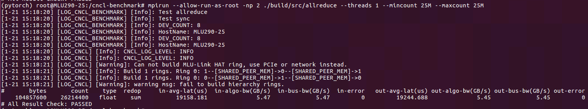

从图中 in-avg-lat 一栏可以看到, 2 MLU 使用 shared_peer_memory 传输 25 M 数据的耗时应该在 19.158 ms

使用 cncl_benchmark 测出单次 iteration 各种通信量的耗时, 并求和, 总耗时加上单卡单次 iteration 的时间, 即为计算, 通信完全无重叠的时间

## cnperf 定位问题: 

概括地, cnperf 性能调试主要分为两个步骤, 细节会在子章节中描述:

* 使用 cnperf 生成 timeline, 并用 chrome 读取

cnperf-cli record 后必须跟`字符串`，所以必须将 python 命令打包成一整个字符串，细节参考子章节 "cnperf-cli record & tracing"

驱动 4.20.x 之前, cnperf-cli 不支持多进程, 使用 cnperf 抓取多进程, 需修改虚拟环境, 细节参考转自张驰的子章节 "分布式插入 cnperf 的方式" 

* 分析 timeline 定位问题

分析 timeline 定位问题, 参考 "timeline 分析"

### cnperf-cli record & tracing

cnperf-cli record 不接受训练脚本为 `bash xxx.sh` 的形式, 所以需要:

* 使用 `echo ${cmd}` 获取 `python xx.py` 形式的训练命令, 设命令为 `${cmd}`

* 运行 `cnperf-cli record "${cmd}"` 在当前目录下生成 `dltrace` 文件夹

* 运行 `cnperf-cli timechart` 命令, 在当前目录下生成 `timechart.json`

* 打开 chrome 浏览器, 在地址栏输入 `chrome://tracing`, 加载 `timechart.json`

常见问题:

* cnperf 不支持 exe:

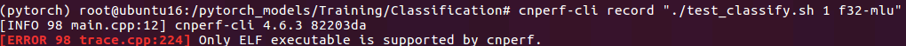

请确保 "" 中的字符串是一个以 python 命令为开头的命令, 请勿使用诸如 `bash`, `./` 等作为开头的命令

* 提示 cnperf-cli 找不到:

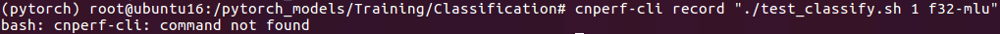

```shell
export PATH=$NEUWARE_HOME/bin:$PATH
```

* CNPAPI 占用:

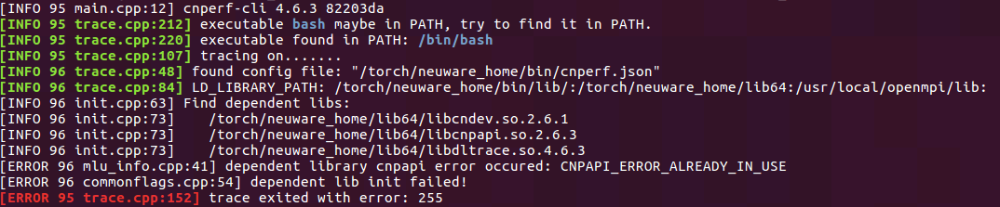

请确保没有其他 cnperf-cli 在运行, 同时确保没有开多重 cnperf-cli 命令
如果没有在其他 cnperf-cli 在运行, 但是仍然提示占用, 则有可能为残留进程, 请运行命令关闭残留进程:

```shell
ps aux | grep cnperf | tr -s ' ' | cut -d' ' -f 2 | tr '/n' ' ' | xargs kill -9
```

* `cnperf-cli timechart` 命令报错:

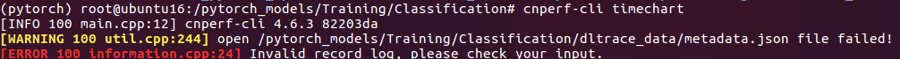

往往是运行中出现了中断, 程序没有正常结束, 如果要正常生成 timeline, 需要程序正常结束

* `timechart.json` 文件过大, 无法加载:

`timechart.json` 文件的大小和抓取时间和`cnperf.json` 相关

需要控制一下脚本中的 iteration 数量, 如果网络还是过大, 如使用 transformer 类网络, 由于重复性, 可以修改 `layer = 1` 逐层分析

此外,还可以通过修改 `cnperf.json` 的方式去掉不想在 timeline 中呈现的元素

例如, 不想在 timeline 中看到 `cnrtCnpapiInternalReserved0` 和 `cnrtCnpapiInternalReserved1` 可以在 `cnperf.json` 中添加:

```shell
      {
          "file_name": "cambricon apis",

          "trace": null,

          "notrace": [
            { "func_name": "cnrtCnpapiInternalReserved0" },
            { "func_name": "cnrtCnpapiInternalReserved1" },
          ]
      }
```

至此, timeline 获取完成

### 分布式插入 cnperf 的方式 (此为老版本遗留问题, 如果是4.20.x驱动, 请忽略)

此章节包括三个部分:原理简介, 寻找修改文件位置, 修改细节, mpirun 方式修改

#### 原理简介

分布式运行往往会借助一个 `launch.py` 脚本启多进程, 由于 4.20.x 驱动之前, cnperf-cli 不支持多进程, 所以需要进行修改

一种方式是修改 `launch.py`, 目的是做一个判断, 若 `rank==0` 则使用 `cnperf-cli record` 启进程, 否则使用原本方式

另一种方式是用 mpirun 启动, 通过 MPI 环境变量可以获取 rank, 若 `rank==0` 则使用 `cnperf-cli record` 启进程, 否则使用原本方式

#### 修改的文件

* 获取虚拟环境:

运行 `pip show pip` 命令, 会打印已安装的 `site-packages` 的位置
例如:
```Shell
Location: ${venv_lib}
```
那么 `${venv_lib}` 即为您的虚拟环境安装 `site-packages` 的目录

* 寻找修改文件位置:

如下表所示:

+------------+------------+-----------------------------------------+------------------------------------------------+
| framework  | launch     |   launch command                        |                   location                     |
+============+============+=========================================+================================================+
|  Pytorch   | DDP        |   python -m torch.distributed.launch    |  ${venv_lib}/torch/distributed/launch.py       |
+------------+------------+-----------------------------------------+------------------------------------------------+
|  Pytorch   | deepspeed  |   deepspeed                             |  ${venv_lib}/deepspeed/launcher/launch.py      |
+------------+------------+-----------------------------------------+------------------------------------------------+
| Pytorch/TF | horovod    |   horovod                               |  horovod use mpirun launch                     |
+------------+------------+-----------------------------------------+------------------------------------------------+

### 修改细节:

使用 deepspeed luanch 的修改方式:

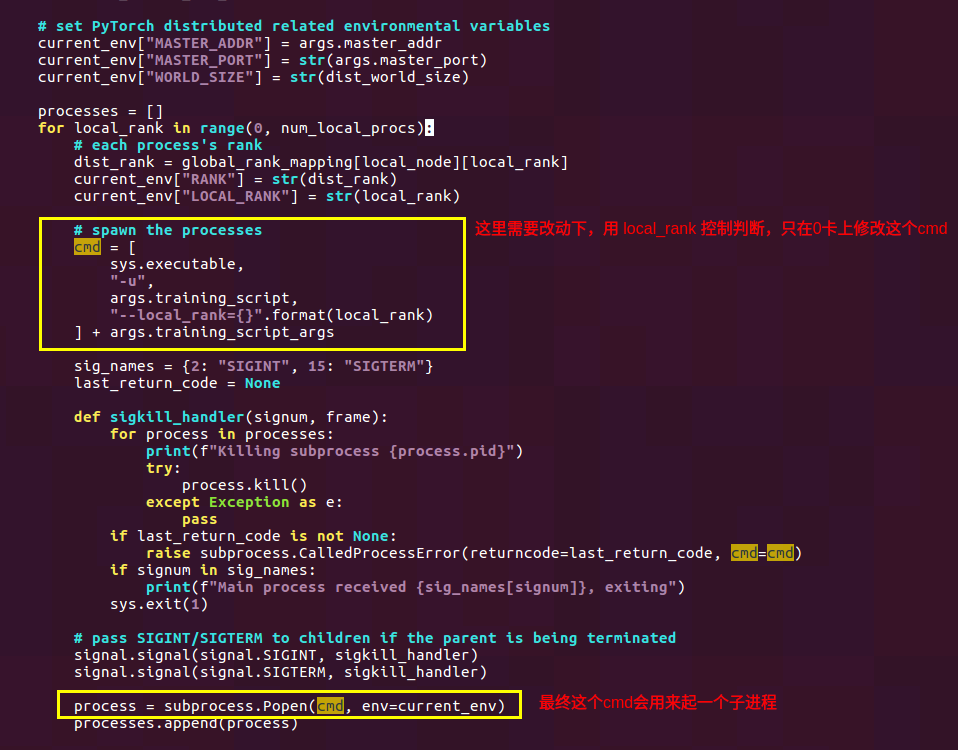

修改为:

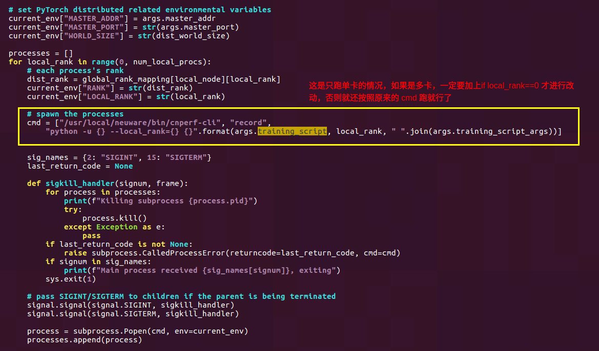

使用 Pyotrch DDP 的修改方式

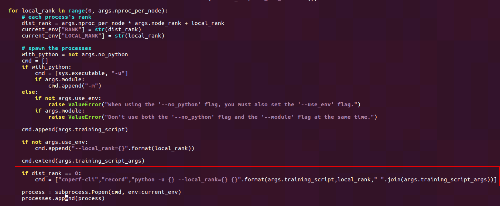

* mpirun 方式修改:

假设单机单卡的运行脚本为`${_1proc_cmd}`,则使用 mpirun 修改的多进程脚本为:

```shell
multi_cmd() {
    proc_num=${1}
    _log_dir=logs
    _log_file="${_log_dir}/log-$(date +%s).log"
    mkdir -p ${_log_dir}
    _cmd_file=./_cmd_run.sh
    cat <<EOF > ${_cmd_file}
if [ \$PMI_RANK ]; then
  rank=\${PMI_RANK}
elif [ \$PMIX_RANK ]; then
  rank=\${PMIX_RANK}
elif [ \$OMPI_COMM_WORLD_RANK ]; then
  rank=\${OMPI_COMM_WORLD_RANK}
else
  rank=0
fi
rank=\$((rank + 0))

cmd="${_1proc_cmd}"
if [ \$rank = 0 ]; then
    cnperf-cli record --cpu false --filter_config_file cnperf.json\
       "\$cmd" -o $_log_dir/cnperf
else
    \$cmd
fi
EOF
    cmd="mpirun --allow-run-as-root --report-bindings -map-by socket -rank-by core -bind-to socket -np ${proc_num} bash ${_cmd_file}"
    echo $cmd > ${_log_file}
    ${cmd} |& tee -a ${_log_file}
}

multi_cmd $6
```

### timeline 分析

对于分布式内容, timeline 分析的目的主要是找出网络中对应通信量的通信时间, 并确认通信没有引入gap.
概括地, 本节包括四部分内容:

* 名词解释

* 理想情况, 需要明确如果未产生异常时, 理想情况是怎样的, 用实际 timeline 进行对比, 从而定位是哪部分拖慢了 E2E , 进而定位问题产生的模块

* 分析目标, 针对理想情况, 分段分析 timeline, 如果此段出现问题, 将问题转给对应的模块研发来查看

* 操作步骤, 根据已有 timeline 进行操作得到网络中通信时间；常见问题, 补充一些常见的问题, 这些问题可能是已知或者被认为是期望的现象

#### 名词解释

1.H2D拷贝: H(host)2(to)D(device)拷贝, 将数据从 CPU 拷贝到 MLU/GPU 

2.HW time: H(hard)W(ware) 时间, 硬件时间, 此语境下指 cnnl 算子在 MLU 上计算时间(包括拷贝,计算等)

3.计算 queue: CPU 将 cnnl 算子依次下发至计算队列中, 在 timeline 上, 以类似 `MLUXXXKernel<dtype>[Ux]` 的格式显示出来

4.通信 queue: CPU 将通信任务异步下发至通信队列中, 在 timeline 上, 以类似 `mlulink operator` 或 `automic operation` 等显示出来

5.gap: 指间隔, 在该段时间内, 既没有 CPU 下发任务, 计算 queue 以及通信 queue 上均无任何操作, 或者计算 queue 和通信 queue 上均无任何操作

6.扩展性: 此处指弱扩展性, 计算方法为`多卡的总吞吐`/`多卡卡数`/`单卡吞吐`

#### 理想情况

理想情况下:

H2D拷贝(单)+单卡算子时间(硬件时间HW time单)=单卡总时间

H2D拷贝(多)+多卡时单卡算子时间(硬件时间HW time多)+拷贝入通信buffer时间(硬件时间2 HW time 2)+多卡通信无法与计算重叠掩盖时间=多卡总时间

1.HW time 与 H2D:

单卡算子时间=多卡时单卡算子时间(模型并行除外)

H2D拷贝(单)≈H2D拷贝(多),通信时需要进行异步拷贝

引入额外拷贝时间(硬件时间2), 拷贝时间与通信总量相关, 370/290下 由于设计原因与计算kernel串行

2.计算与通信重叠,去除所有额外同步点

3.多卡通信时间根据通信量符合预期

4.没有gap

预期是,一般情况下,单机 PCIE 扩展性在90%以上,MLULINK 扩展性在95%以上,否则需要分析原因

#### 分析目标:

对应理想状态下的1,2,3,4需要分析:

1.H2D是否符合预期, HW算子时间是否符合预期

1.1 H2D拷贝(单)  ≠  H2D拷贝(多),目前版本可能出现类似问题,需要找框架优化

1.2 单卡算子时间   ≠  多卡时单卡算子时间,可能是芯片降频,向驱动人员申请锁频版本固件

1.3 算子本身慢,则抓出gen_case交给算子人员分析,优化算子实现方式,一般不属于分布式性能调优内容: 交给cnnl的人分析

   1.4 输入数据不均衡也会导致HW算子时间不同: 语言类网络中,各个rank之间的输入数据seqlength本身不同,所以HW算子时间不同

2.分布式框架是否慢,有过多的等待,是否不合理导致计算通信无法重叠:

优化分布式框架:process_group_cncl.cpp/hvd

3.通信是否慢,多卡通信时间与通信量不符

如果在一定通信量下, 网络中消耗的时间与cncl-benchmark一致,说明符合期望,如果还是觉得慢则需要优化驱动/通信库cncl

如果在一定通信量下, 网络中消耗的时间与cncl-benchmark不一致,说明哪里出了bug,需要定位

4.gap是否时间过长,gap是否合理,去除额外同步点

正常在开启task_acc情况下,gap均是us级别的,如果出现了任何超过us级的gap,说明出了bug,需要定位gap产生的位置并修复

#### 操作步骤

操作步骤主要结合图片说明, 主要包括以下几步:

* 放大 timeline 至一个 iteration

* 根据 correlation 获取对应 CPU 行为

* 根据 CPU CNCL 任务下发依次获得通信量对应的通信时间

目的是与 cncl_benchmark 通信时间对比, cncl_benchmark 通信时间获取方法见"耗时下界估算"一节, 运行网络获取通信量,可以形成例如一个如下的表格:

+-------------+---------+-----------+---------+------------------------+----------------------+
|      op     |   type  |   count   | size(MB)| benchmark latency (ms) | network latency(ms)  |
+=============+=========+===========+=========+========================+======================+
|cnclAllReduce|cnclFloat|	4197376   | 16.01   |	23                     |  68                  |
+-------------+---------+-----------+---------+------------------------+----------------------+
|cnclAllReduce|cnclFloat|	54588416  | 208.24  | 381                    | 428                  |
+-------------+---------+-----------+---------+------------------------+----------------------+
|cnclAllReduce|cnclFloat|	52490240  | 200.23  | 371                    | 419                  |
+-------------+---------+-----------+---------+------------------------+----------------------+
|cnclAllReduce|cnclFloat|	52482048  | 200.2   | 371                    | 375                  |
+-------------+---------+-----------+---------+------------------------+----------------------+
|cnclAllReduce|cnclFloat|	57286656  | 218.53  | 398                    | 378                  |
+-------------+---------+-----------+---------+------------------------+----------------------+
|cnclAllReduce|cnclFloat|	44687360  | 170.47  | 321                    | 369                  |
+-------------+---------+-----------+---------+------------------------+----------------------+
|Total	      |         | 	 	      | 1013.68 | 1865                   | 2037                 |
+-------------+---------+-----------+---------+------------------------+----------------------+

下面用图文的方法说明了操作步骤,和一些常见问题:

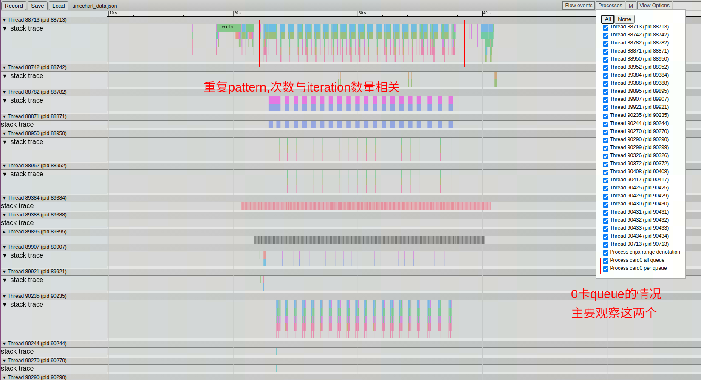{width=80%}

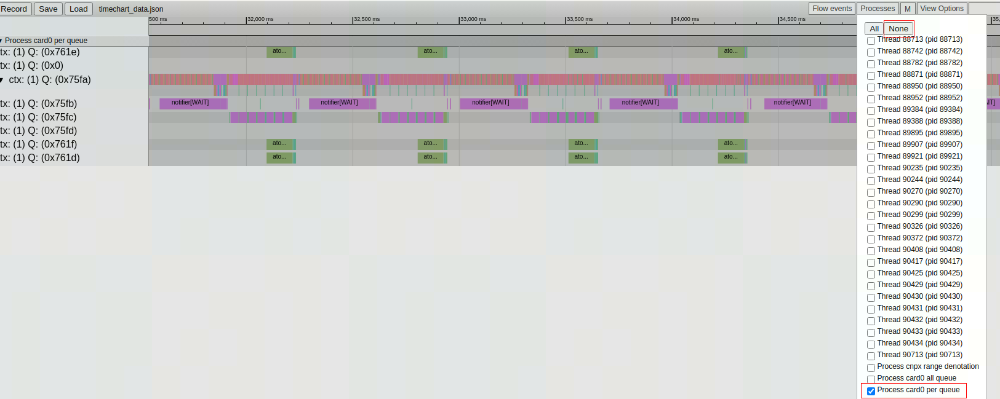{width=80%}

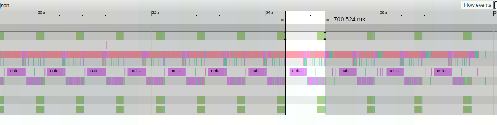{width=80%}

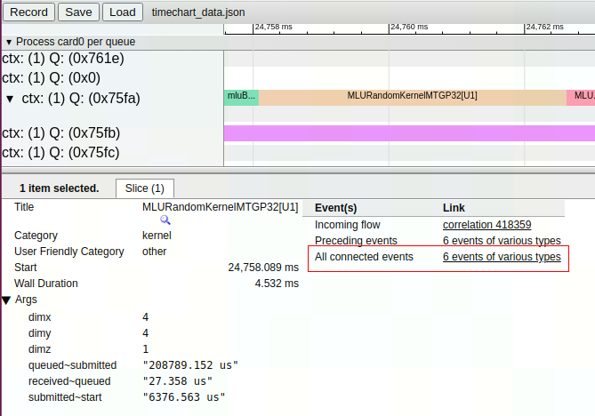{width=80%}

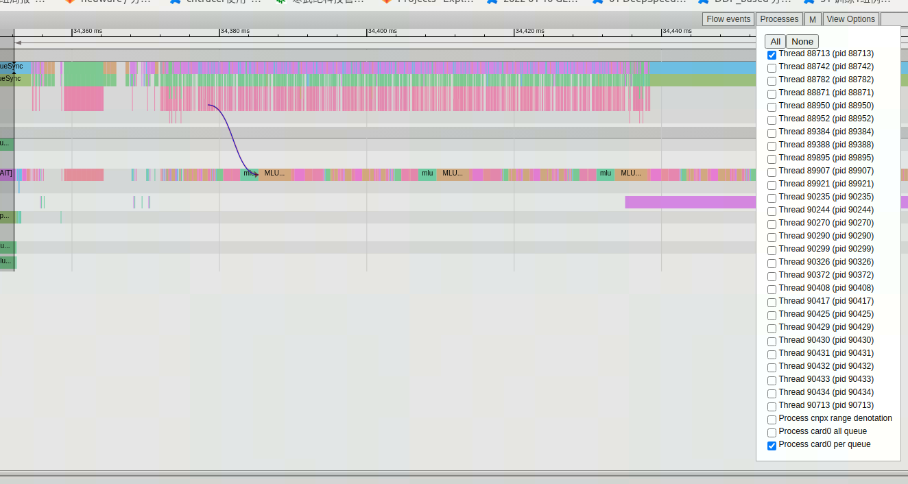{width=80%}

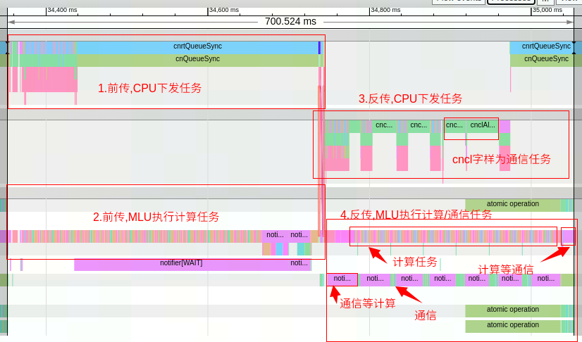{width=80%}

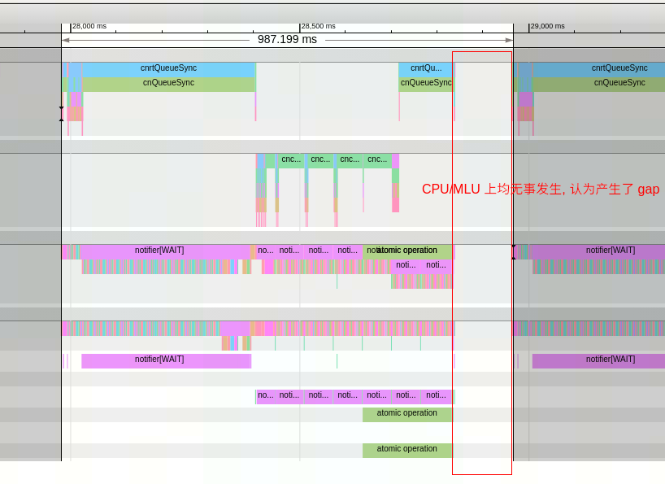{width=80%}

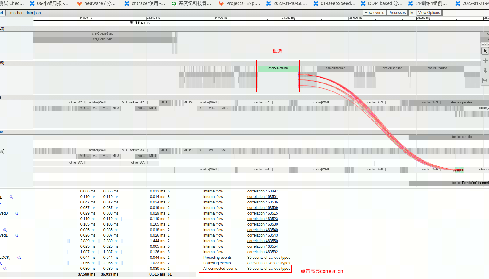{width=80%}

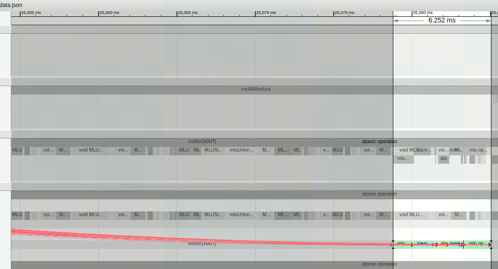{width=80%}

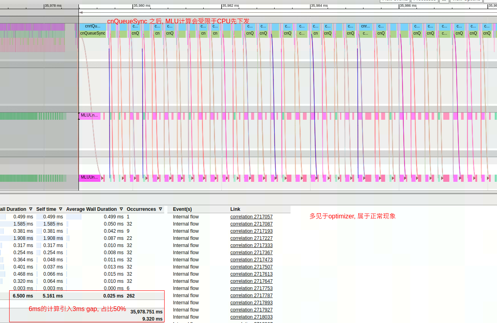{width=80%}

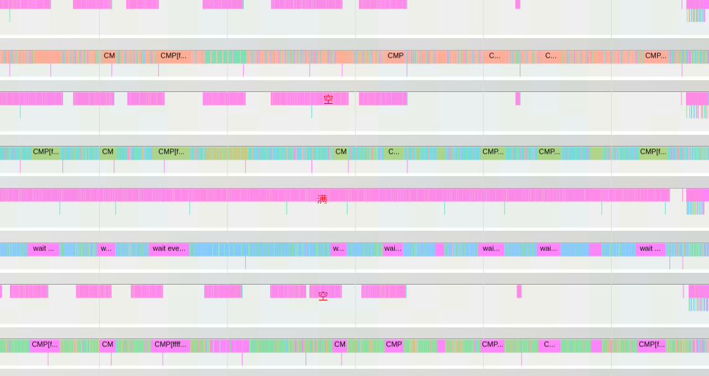{width=80%}
